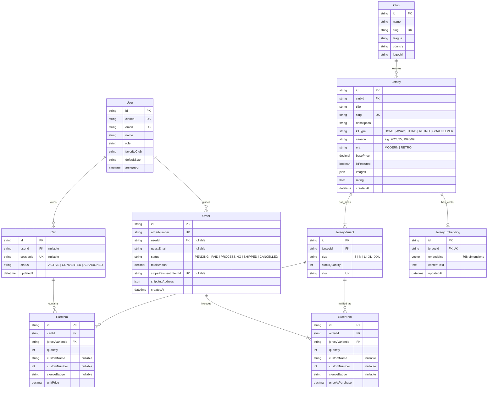

# Backend Plan — ShopMate AI (KitRoom API)

## 1. Requirements Interview (Backend)

### Core Problem
The backend serves as a high-performance, type-safe API for an AI-powered football jersey e-commerce platform. It provides:
1. Traditional relational e-commerce services (product catalog, faceted queries, multi-variant inventory tracking, cart management, and order processing).
2. Advanced vector similarity search using PostgreSQL `pgvector` to enable natural language queries (e.g., *"lightweight black and gold kit"* or *"retro 90s Italian club jersey"*).
3. An AI orchestration engine supporting Server-Sent Events (SSE) streaming, conversation memory (Redis), and LLM function calling (search, cart mutation, size advice).
4. Secure payment integration with Stripe (PaymentIntents and webhook idempotency with database row locking).

### Domain Entities
1. **Users & Customers:** Profile, Clerk auth identifier, favorite clubs, default size preferences.
2. **Jerseys & Variants:** Clubs, leagues, jersey metadata (home/away/retro, season, materials, imagery), and multi-size inventory variants (SKU, size, stock quantity).
3. **Semantic Embeddings (`pgvector`):** Vector representation (768-dim embeddings from Gemini text-embedding-004) mapped to jerseys for semantic similarity search.
4. **Carts & Line Items:** Session-based and authenticated user carts with support for personalized printing (player name, squad number, competition sleeve badges).
5. **Orders & Transactions:** Financial transaction records, Stripe payment intent IDs, transactional inventory decrements, and order lifecycle statuses.
6. **AI Conversations & Sessions:** Ephemeral chat sessions stored in Redis with structured tool execution audit logs.

### Critical Business Rules
1. **Atomic Inventory Decrement & Row-Locking:** During checkout confirmation / Stripe webhook execution, stock deduction MUST use database transactions (`BEGIN ... COMMIT`) and `SELECT ... FOR UPDATE` (or Prisma interactive transaction with atomic `decrement` guarded by `gte`) to prevent overselling limited retro kits.
2. **Stripe Webhook Idempotency:** Webhook events must verify signature with Stripe CLI/secret and check against an `idempotency_keys` or order status check to prevent duplicate order fulfillment on retries.
3. **Server-Side Price Validation:** The frontend NEVER dictates product prices or totals. The backend recalculates base kit price + custom printing addon + badge addon before creating Stripe PaymentIntents.
4. **pgvector Cosine Similarity:** Semantic search vector queries calculate cosine distance (`<=>`) using an HNSW index on the embedding table, combined with traditional SQL filters (`WHERE price <= $1 AND size = $2`).

### External Integrations
- **Clerk:** Authentication token verification (`@clerk/express` or `@clerk/backend`).
- **Stripe:** Payment Intents API and raw body Webhook verification.
- **Google Gemini API / OpenAI API:** Text embeddings (`text-embedding-004`) and Function Calling chat completion with streaming SSE.
- **Redis:** Redis cache for catalog queries, rate limiting (`express-rate-limit` with Redis store), and active session carts.

### Auth Model
- Third-party authentication via Clerk. Requests to protected routes pass an `Authorization: Bearer <token>` header, verified via Clerk middleware.
- Guest sessions are tracked with an encrypted `x-session-id` UUID header for non-logged-in cart preservation.

### Tech Stack Constraints
- **Language/Runtime:** Node.js (v20+) with TypeScript (strict mode, ES Modules).
- **Framework:** Express.js with custom `asyncHandler`, `ApiResponse`, and `ApiError` hierarchy.
- **ORM & Database:** Prisma ORM with PostgreSQL + `pgvector` extension.
- **Caching & Sessions:** Redis (ioredis).
- **Validation:** Zod schemas for 100% of request bodies, query params, and environment variables.
- **Logging:** Pino structured logger with request correlation IDs (`pino-http`).
- **Testing:** Jest + Supertest for unit, integration, and vertical slice tests.
- **Containerization:** Multi-stage Dockerfile and `docker-compose.yml` (Postgres with pgvector, Redis, Express API).

---

## 2. Data Model Design (Prisma Schema Architecture)

### Entity Definitions & Relational Architecture

### Key Database Indexes & Optimizations
1. `Jersey(slug)` — Unique B-Tree index for ultra-fast PDP lookup.
2. `Jersey(clubId, kitType, season)` — Composite index for catalog filtering.
3. `JerseyVariant(jerseyId, size)` — Composite index for size checks.
4. `JerseyEmbedding(embedding)` — **HNSW (Hierarchical Navigable Small World) index** using cosine distance (`vector_cosine_ops`) for sub-millisecond semantic search.
5. `Order(stripePaymentIntentId)` — Unique index for O(1) webhook reconciliation.
6. `Cart(sessionId)` and `Cart(userId)` — Indexed for rapid cart retrieval.

---

## 3. API Contract Table

### System & Health
| Method | Endpoint | Purpose | Auth | Request Body | Response Shape |
|--------|----------|---------|------|--------------|----------------|
| GET | `/health` | Liveness & Readiness probe (verifies Postgres & Redis) | None | — | `{ status: "ok", timestamp: string, services: { db: "connected", redis: "connected" } }` |

### Catalog & Discovery
| Method | Endpoint | Purpose | Auth | Request Query / Body | Response Shape |
|--------|----------|---------|------|----------------------|----------------|
| GET | `/api/jerseys` | Filterable catalog with pagination & facets | None | `?league=&club=&kitType=&season=&minPrice=&maxPrice=&search=&page=&limit=` | `{ success: true, data: { jerseys: Jersey[], pagination: { total, page, pages }, facets: object } }` |
| GET | `/api/jerseys/:slug` | Get single jersey details with all size variants & stock | None | — | `{ success: true, data: JerseyDetail }` |
| GET | `/api/jerseys/featured` | Get trending & editor's pick kits (Redis cached) | None | — | `{ success: true, data: Jersey[] }` |
| GET | `/api/clubs` | List all available football clubs and leagues | None | — | `{ success: true, data: Club[] }` |

### AI Shopping Agent & Semantic Search
| Method | Endpoint | Purpose | Auth | Request Body | Response Shape |
|--------|----------|---------|------|--------------|----------------|
| POST | `/api/ai/chat` | SSE Stream: Multi-turn chat with KitBot AI + Function Calling | Optional | `{ sessionId: string, message: string, history?: ChatMessage[] }` | `text/event-stream` (streams token chunks, tool-call starts, tool execution results, final reply) |
| POST | `/api/ai/semantic-search` | Vector search over jerseys via Gemini embeddings & `pgvector` | None | `{ query: string, limit?: number, minSimilarity?: number }` | `{ success: true, data: { results: Array<{ jersey: Jersey, similarity: number }> } }` |

### Cart Management
| Method | Endpoint | Purpose | Auth | Request Body | Response Shape |
|--------|----------|---------|------|--------------|----------------|
| GET | `/api/cart` | Retrieve current cart items, customization, and calculated totals | Session/Auth | — | `{ success: true, data: CartWithItems }` |
| POST | `/api/cart/items` | Add jersey variant to cart (checks available stock) | Session/Auth | `{ jerseyVariantId: string, quantity: number, customName?: string, customNumber?: number, sleeveBadge?: string }` | `{ success: true, data: CartWithItems }` |
| PATCH | `/api/cart/items/:itemId` | Update quantity of a line item | Session/Auth | `{ quantity: number }` | `{ success: true, data: CartWithItems }` |
| DELETE | `/api/cart/items/:itemId` | Remove an item from cart | Session/Auth | — | `{ success: true, data: CartWithItems }` |
| DELETE | `/api/cart` | Clear entire cart | Session/Auth | — | `{ success: true, message: "Cart cleared" }` |

### Payments & Checkout
| Method | Endpoint | Purpose | Auth | Request Body | Response Shape |
|--------|----------|---------|------|--------------|----------------|
| POST | `/api/payments/create-intent` | Verify inventory & create Stripe PaymentIntent | Optional (Email req.) | `{ shippingAddress: AddressObject, guestEmail?: string }` | `{ success: true, data: { clientSecret: string, orderId: string, totalAmount: number } }` |
| POST | `/api/webhooks/stripe` | Stripe webhook listener (`payment_intent.succeeded`) | Stripe Sig | Raw Stripe Event payload | `{ received: true }` |

### Orders & User Profile
| Method | Endpoint | Purpose | Auth | Request Body | Response Shape |
|--------|----------|---------|------|--------------|----------------|
| GET | `/api/orders/:id` | Get order confirmation & receipt | Optional (Secured token) | — | `{ success: true, data: OrderDetail }` |
| GET | `/api/orders/mine` | List authenticated user's order history | Clerk Auth | — | `{ success: true, data: OrderSummary[] }` |
| GET | `/api/users/me` | Get user profile & club preferences | Clerk Auth | — | `{ success: true, data: UserProfile }` |
| PATCH | `/api/users/preferences` | Update favorite club and default kit size | Clerk Auth | `{ favoriteClub?: string, defaultSize?: string }` | `{ success: true, data: UserProfile }` |
| POST | `/api/webhooks/clerk` | Clerk user sync webhook (creates/updates User record) | Clerk Sig | Raw Clerk Event | `{ received: true }` |
