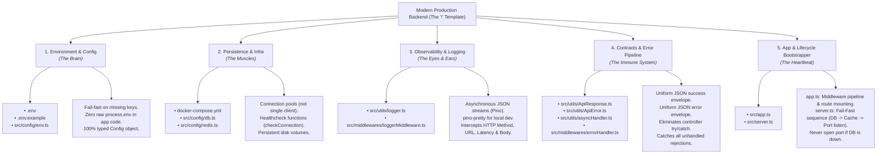

# The "Emmet `!`" of Production Backend Architecture

Just like typing `!` in VS Code expands into the perfect HTML5 boilerplate, **every production backend across the software industry consists of exactly 5 non-negotiable pillars** before writing a single line of business logic.

---

## 🗺️ The Architecture Mindmap

---

## 🏛️ The 5 Universal Pillars Explained

### Pillar 1: Environment & Config (The Brain)
- **Files:** `.env`, `.env.example`, `src/config/env.ts`
- **What it does:** Reads variables, validates that required secrets exist, and exports a frozen, typed `config` object.
- **Golden Rule:** **Never sprinkle `process.env.X` across routes.** If an API key is missing, crash immediately at startup with an explicit message rather than failing silently on an incoming request 3 hours later.

### Pillar 2: Persistence & Infrastructure (The Muscles)
- **Files:** `docker-compose.yml`, `src/config/db.ts`, `src/config/redis.ts`
- **What it does:** Creates connection pools for your database (PostgreSQL/MongoDB) and in-memory cache (Redis).
- **Golden Rule:** Each service file must export an `async checkConnection()` function so the bootstrapper can verify reachability before taking traffic.

### Pillar 3: Observability & Logging (The Eyes & Ears)
- **Files:** `src/utils/logger.ts`, `src/middlewares/loggerMiddleware.ts`
- **What it does:** Replaces synchronous `console.log()` with structured JSON logging (Pino). Intercepts incoming requests and outgoing response bodies.
- **Golden Rule:** Follow **12-Factor App Rule 11**: Log to `stdout`. Use `pino-pretty` in dev for human readability, raw JSON in production for cloud aggregators (Better Stack, Datadog).

### Pillar 4: Contracts & Error Pipeline (The Immune System)
- **Files:** `ApiResponse.ts`, `ApiError.ts`, `asyncHandler.ts`, `errorHandler.ts`
- **What it does:** 
  1. `ApiResponse`: Wraps all 200/201 data in `{ statusCode, data, message, success: true }`.
  2. `ApiError`: Extends `Error` with `{ statusCode, message, errors, stack, success: false }`.
  3. `asyncHandler`: Wraps async controllers in `Promise.resolve(fn(req,res,next)).catch(next)`, eliminating repetitive `try/catch`.
  4. `errorHandler`: The 4-argument Express error middleware `(err, req, res, next)` catching all errors and formatting them into standard `ApiError` responses.
- **Golden Rule:** No client should ever receive raw HTML crash pages or unformatted errors.

### Pillar 5: App & Lifecycle Bootstrapper (The Heartbeat)
- **Files:** `src/app.ts`, `src/server.ts`
- **What it does:**
  - `app.ts` assembles the middleware pipeline: `json()` -> `urlencoded()` -> `loggerMiddleware` -> routes -> `errorHandler`.
  - `server.ts` runs the **Fail-Fast Boot Sequence**:
    1. Connect DB -> Success.
    2. Connect Redis -> Success.
    3. `app.listen(PORT)` -> Online.
- **Golden Rule:** Database before Server. Never call `app.listen()` until the database and cache connection checks have resolved.

---

## ⚡ The "One-Shot Agent Prompt" for Future Projects

Next time you start any new backend project with an AI agent, you don't need multiple sessions. You can paste this exact instruction:

> *"Scaffold the 5-pillar production backend foundation for [Express / Fastify + TypeScript]:*
> *1. Typed config module validating `.env`.*
> *2. PostgreSQL (pg) and Redis (ioredis) clients with exportable health check functions.*
> *3. Pino structured logger with request/response body interception.*
> *4. ApiResponse, ApiError, asyncHandler, and global errorHandler middleware.*
> *5. Fail-Fast server.ts (verify DB and Redis before calling app.listen).*
> *Do it in one clean shot with zero compiler diagnostics."*
